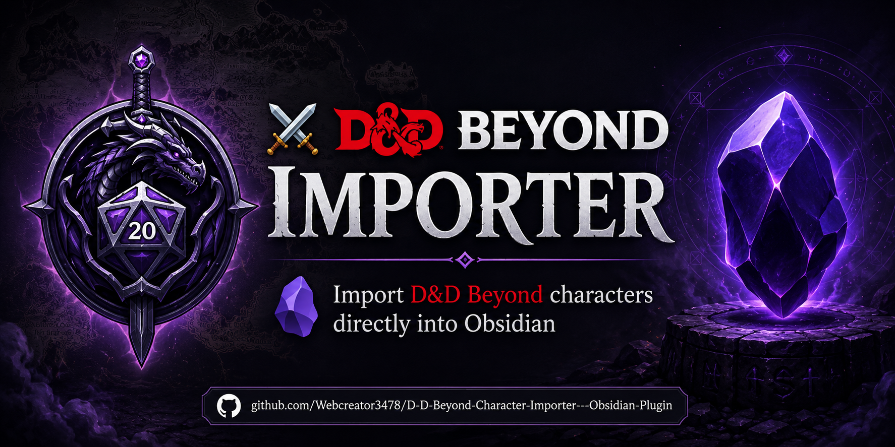
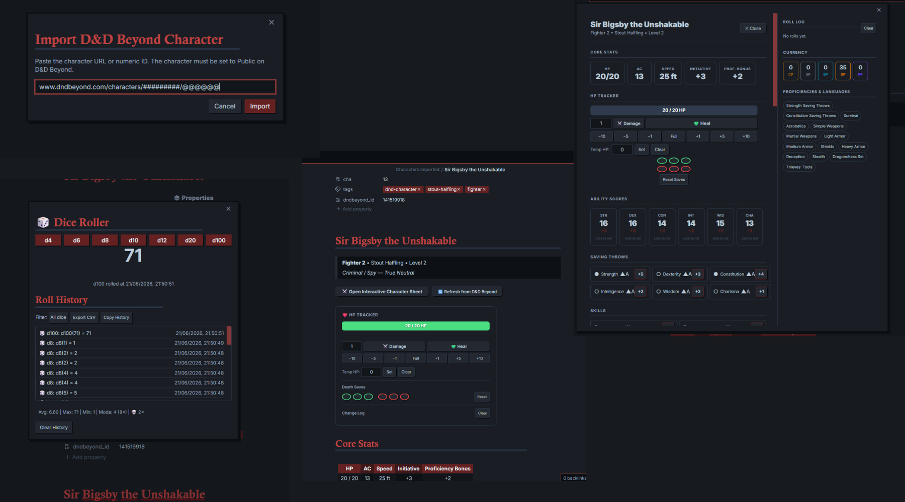
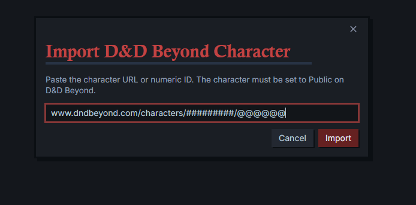
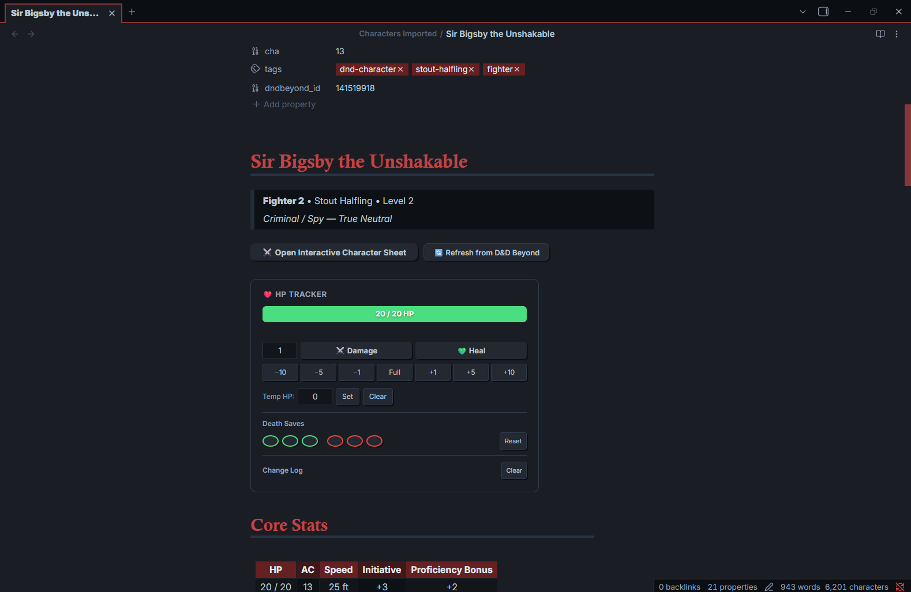
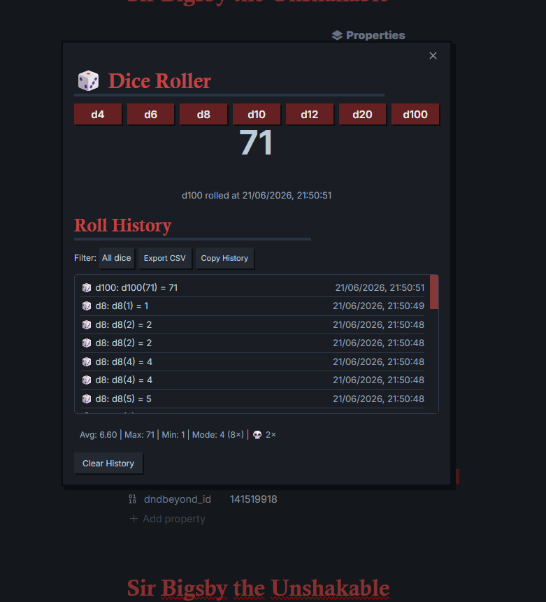
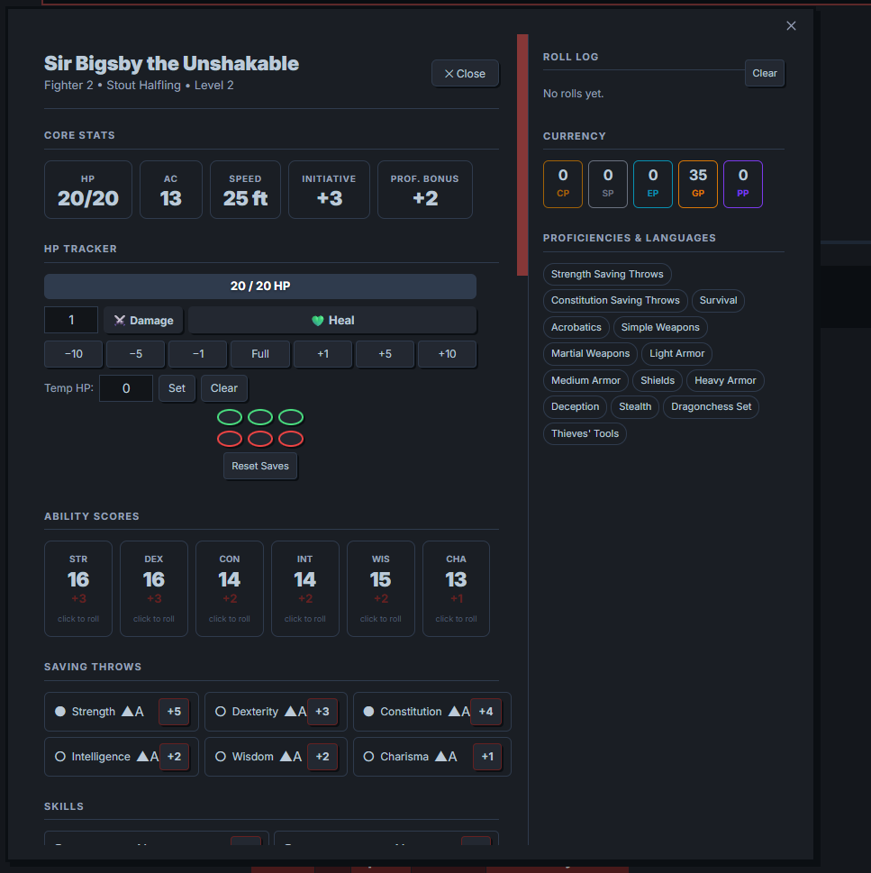

<div align="center">



# ⚔️ DnD Beyond Importer

### Pull any public D&D Beyond character into Obsidian — formatted, queryable, and ready to roll.

<p>


</p>

<p>
<a href="#-what-it-does"></a>
<a href="#-installation"></a>
<a href="#-screenshots"></a>
<a href="#-contributors"></a>
<a href="#-support"></a>
</p>

</div>

<p align="center">
  
</p>

---

## ✨ What it does

| Feature | Description |
|---|---|
| 📋 **Full Character Sheet** | Ability scores, saving throws, skills, HP, AC, speed, proficiency bonus |
| ⚔️ **Equipment** | Inventory table with equipped status and weight |
| 📖 **Spells** | Grouped by level, with school, cast time, range, concentration, and prepared status |
| 🌟 **Features & Traits** | Racial traits, feats, personality, ideals, bonds, flaws |
| 💰 **Currency** | All coin types tracked automatically |
| 📜 **Backstory & Notes** | Backstory and campaign notes pulled straight from D&D Beyond |
| 🏷️ **YAML Front Matter** | Key stats exposed as queryable properties for Dataview |
| 🔄 **Re-import / Refresh** | One-click refresh button updates the existing note in place |
| 🎲 **Dice Roller** | d4 through d100, with toast notifications and roll history |
| 🗺️ **Interactive Character Sheet** | Full visual overlay with HP tracking, rolling, and spell slots |

---

## 📦 Installation

### Automatic (recommended for stable releases)
1. Open **Settings**
2. Go to **Community plugins**
3. Click **Browse**
4. Search **"DnD Beyond Importer"**
5. Click **Install**, then **Enable**
6. Configure plugin settings *(optional)*

### Manual
1. Download the latest release zip from the [Releases page](https://github.com/Webcreator3478/D-D-Beyond-Character-Importer---Obsidian-Plugin/releases) (or build from source below)
2. Unzip into your vault's plugin directory:
   ```
   <YourVault>/.obsidian/plugins/dndbeyond-importer/
   ```
   The folder needs `main.js`, `manifest.json`, and `styles.css`
3. Go to **Obsidian → Settings → Community Plugins** and enable **DnD Beyond Importer**

### Build from source
```bash
git clone https://github.com/Webcreator3478/D-D-Beyond-Character-Importer---Obsidian-Plugin.git
cd dndbeyond-importer
npm install
npm run build
```
This produces `main.js` in the project root.

---

## 🚀 Usage

### Importing a character

**Ribbon:** click the ⚔️ sword icon in the left sidebar
**Command palette:** `Ctrl/Cmd + P` → *DnD Beyond Importer: Import character from D&D Beyond*

Any of these input formats work:
- Full URL — `https://www.dndbeyond.com/characters/137202151/GpDg8C`
- Short URL — `https://www.dndbeyond.com/characters/137202151`
- Bare ID — `137202151`

> ⚠️ The character sheet must be set to **Public** on D&D Beyond. Private sheets can't be fetched.

### Interactive Character Sheet

After importing, click the **⚔️ Open Interactive Character Sheet** button at the top of any character note to open the full interactive overlay. The Markdown note underneath stays untouched.

Next to it, **🔄 Refresh from D&D Beyond** re-fetches the character and updates the note in place — handy after leveling up or changing equipment. It shows a brief ✅ or ❌ confirmation, and is disabled on notes without a D&D Beyond character ID.

The interactive sheet covers HP tracking, ability score rolls, saving throws, skills, actions & attacks, spell slots, spells, equipment, features & traits, session notes, a live roll log, currency, and proficiencies.

### Standalone Dice Roller

**Ribbon:** click the 🎲 dice icon in the left sidebar
**Command palette:** *DnD Beyond Importer: Open Dice Roller*

Available dice: d4, d6, d8, d10, d12, d20, d100. Each roll appears in the modal, fires a toast (e.g. `🎲 d20: 17`), and logs to history with a timestamp. History caps at the last 50 rolls and can be wiped with **Clear History** — it persists for the session.

---

## 📸 Screenshots

<p align="center">
  
  
</p>

<p align="center">
  
  
</p>

<p align="center">
  
</p>

---

## ⚙️ Settings

| Setting | Default | Description |
|:---|:---:|:---|
| Output folder | `Characters` | Where character notes are saved in your vault |
| Include spells | ✓ | Spell list and spell slots |
| Include equipment | ✓ | Inventory table |
| Include features & traits | ✓ | Racial traits, feats, personality traits |
| Include backstory & notes | ✓ | Backstory and campaign notes |

---

## 🗂 Note structure

```
---                          ← YAML front matter (queryable with Dataview)
name, race, class, level
hp_max, hp_current, ac …
tags: ["dnd-character", …]
---

# Character Name
> Class • Race • Level N

## Core Stats        (HP / AC / Speed / Initiative / Prof. Bonus)
## Ability Scores    (STR / DEX / CON / INT / WIS / CHA with modifiers)
## Saving Throws     (proficient saves marked ✓)
## Skills            (proficient ✓, expertise ★)
## Proficiencies & Languages
## Currency
## Equipment         (table: item / qty / equipped / weight)
## Features & Traits (racial traits, feats, personality)
## Spells            (grouped by level, spell slots table)
## Backstory & Notes
## Session Notes     ← blank section for your own notes
```

---

## 🔌 A note on the D&D Beyond API

The plugin fetches from an unofficial internal endpoint:
```
https://character-service.dndbeyond.com/character/v5/character/{ID}
```
This isn't officially documented or supported by D&D Beyond / Wizards of the Coast and could change or break without warning. The plugin is **read-only** — it never writes anything back to D&D Beyond.

**Mobile:** character fetching uses Obsidian's `requestUrl` API to work around browser CORS restrictions. This works reliably on desktop (Windows, macOS, Linux). On mobile, the request may be blocked depending on your network setup.

---

## 🐛 Features & Bugs

**Feature requests** — open an issue labeled **Enhancement**. If it fits the plugin's goals, it'll land in the next major or minor update.

**Bugs** — open an issue labeled **Bug**. All bugs are addressed as soon as possible and fixed in the next major, minor, or patch release.

---

## 👥 Contributors

<a href="https://github.com/Webcreator3478/D-D-Beyond-Character-Importer---Obsidian-Plugin/graphs/contributors">
  
</a>

---

## ❤️ Support

<p align="center">
  <a href="https://ko-fi.com/jktaisa">
    
  </a>
</p>

---

<p align="center">
Built with ❤️ for the Obsidian and D&D community.
<br><br>
⭐ Star this repository if you find it useful.
</p>